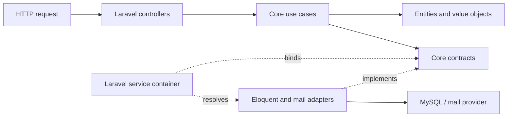

# Clean Architecture with Laravel

A small sales API that demonstrates how to use **Clean Architecture in a Laravel application** without allowing the framework to become the centre of the system.

The application manages sellers and their orders, calculates daily sales and an 8% seller commission, and supports sending daily sales reports. Laravel provides the delivery and infrastructure details; the business rules live in a framework-independent `core`.

## Why this project exists

Laravel makes it easy to build an application quickly, but domain rules can easily become coupled to controllers, Eloquent models and framework services. This project takes a different approach:

- business entities and rules are plain PHP;
- use cases describe application behaviour;
- repository and service contracts are owned by the core;
- Laravel and Eloquent implement those contracts at the edge; and
- dependency injection connects the layers at runtime.

As a result, the core can be tested without booting Laravel or connecting to a database.

## Architecture



The dependency rule points inwards: the `core` does not import Laravel classes. The outer application knows about the core and adapts framework-specific technology to interfaces defined by it.

### Layer map

| Area | Responsibility | Examples |
| --- | --- | --- |
| `core/Entity` | Enterprise entities, DTOs and value objects | `Seller`, `Order`, `Price`, `Email`, `IsoDate` |
| `core/UseCase` | Application-specific business workflows | creating sellers and orders, listing data, producing sales reports |
| `core/Contracts` | Ports required by the use cases | seller/order repositories, date helper and mail services |
| `app/Http` | HTTP delivery and request validation | controllers and form requests |
| `app/External` | Infrastructure adapters | Eloquent repositories and Laravel mail adapter |
| `app/Providers` | Composition root | contract-to-adapter bindings in Laravel's service container |
| `app/Models`, `database/` | Persistence details | Eloquent models, factories and migrations |

For example, `CreateOrderUseCase` depends on `SellerRepository` and `OrderRepository`, both declared in the core. `CoreDependenciesServiceProvider` binds those contracts to their Eloquent implementations. The use case therefore knows what persistence must do, but not how MySQL or Eloquent does it.

## Features

- Create and list sellers.
- Create and list orders.
- List orders belonging to a seller.
- Validate domain data through dedicated value objects.
- Prevent duplicate seller email addresses.
- Reject orders for sellers that do not exist.
- Calculate daily seller sales and an 8% commission.
- Build daily sales reports for sellers and administrators.
- Queue seller report emails through a mail-service port.
- Describe HTTP operations with Laravel OpenAPI attributes.
- Test the core separately from Laravel integrations.

## Technology

- PHP 8.1 or later (the supplied Docker image uses PHP 8.2)
- Laravel 10
- MySQL 8-compatible database
- Redis
- PHPUnit 10
- Nginx and Docker Compose for the containerised environment

## Getting started with Docker

Docker Compose starts the PHP application, MySQL, Nginx and Redis. Docker and Docker Compose are required.

1. Create the environment file:

   ```sh
   cp .env.example .env
   ```

2. For the containerised environment, update these values in `.env`:

   ```dotenv
   APP_URL=http://localhost:8000
   DB_HOST=db
   DB_DATABASE=lara-clean-arch-db
   DB_USERNAME=lara-clean-arch
   DB_PASSWORD=lara-clean-arch-pwd
   REDIS_HOST=redis
   ```

3. Build and start the services:

   ```sh
   docker compose up -d --build
   ```

4. Install PHP dependencies, generate the application key and migrate the database:

   ```sh
   docker compose exec app composer install
   docker compose exec app php artisan key:generate
   docker compose exec app php artisan migrate
   ```

The API is then available at `http://localhost:8000/api`.

> The Compose file currently creates a host user named `victorturra` with UID `1000`. If that does not suit your environment, change the `user` and `uid` build arguments before building the image.

## Local setup

For a non-Docker setup, install PHP 8.1+, Composer and a supported database, then configure the relevant `DB_*` and `MAIL_*` values in `.env`.

```sh
composer install
cp .env.example .env
php artisan key:generate
php artisan migrate
php artisan serve
```

The development server defaults to `http://127.0.0.1:8000`.

## API

All routes are prefixed with `/api`.

| Method | Endpoint | Purpose |
| --- | --- | --- |
| `GET` | `/sellers` | List all sellers |
| `POST` | `/sellers` | Create a seller |
| `GET` | `/orders` | List all orders |
| `POST` | `/orders` | Create an order |
| `GET` | `/sellers/{seller}/orders` | List orders for one seller |

### Create a seller

```sh
curl -X POST http://localhost:8000/api/sellers \
  -H "Content-Type: application/json" \
  -H "Accept: application/json" \
  -d '{"name":"Taylor Smith","email":"taylor@example.com"}'
```

### Create an order

Use the seller UUID returned by the seller endpoint. Monetary values are accepted as integer cents, avoiding floating-point arithmetic in the domain.

```sh
curl -X POST http://localhost:8000/api/orders \
  -H "Content-Type: application/json" \
  -H "Accept: application/json" \
  -d '{
    "seller_id":"SELLER_UUID",
    "price_in_cents":12990,
    "payment_approved_at":"2026-07-13T10:30:00"
  }'
```

An order response exposes both its value in cents and a domain-formatted price, as well as ISO and formatted payment dates.

## Sales-report use cases

The core includes workflows for:

- sending a report to one seller for a selected date;
- sending end-of-day reports to every seller; and
- sending an administrator's daily sales summary.

Seller reports aggregate approved orders and calculate commission at **8%**. Time, persistence and mail delivery are represented by core contracts, so these workflows can be exercised with test doubles. They are application services rather than public API endpoints or scheduled commands in the current implementation.

## Testing

The PHPUnit configuration separates framework-independent core tests from Laravel application tests.

Run every suite:

```sh
php artisan test
```

Run only the core unit and use-case tests:

```sh
composer test-core
```

Run only the Laravel unit and feature tests:

```sh
composer test-app
```

Inside Docker, prefix the commands with `docker compose exec app`, for example:

```sh
docker compose exec app composer test-core
```

Tests use SQLite as configured in `phpunit.xml`. Create the file if it is not already present:

```sh
touch database/database.sqlite
```

## Extending the application

When adding behaviour, keep dependencies pointing towards the core:

1. Model business invariants in an entity or value object.
2. Express the workflow in a use case.
3. Define any required external capability as a contract in `core/Contracts`.
4. Implement that contract in an outer adapter under `app/External`.
5. Bind the implementation in a service provider.
6. Expose the use case through an HTTP, console or queue delivery mechanism.

This keeps new database, messaging or delivery choices replaceable without rewriting the business rules.

## Licence

This project is built on the Laravel application skeleton, which is open-sourced software licensed under the [MIT licence](https://opensource.org/licenses/MIT).
